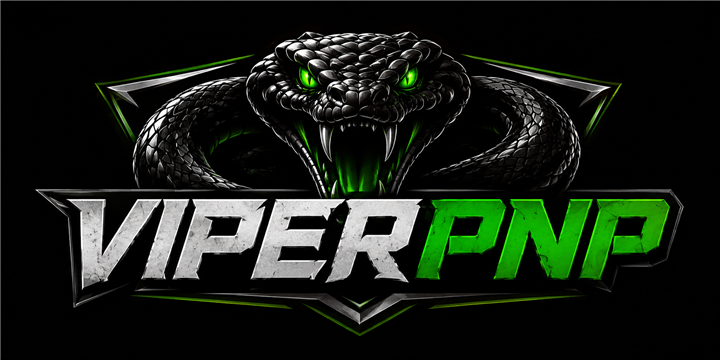
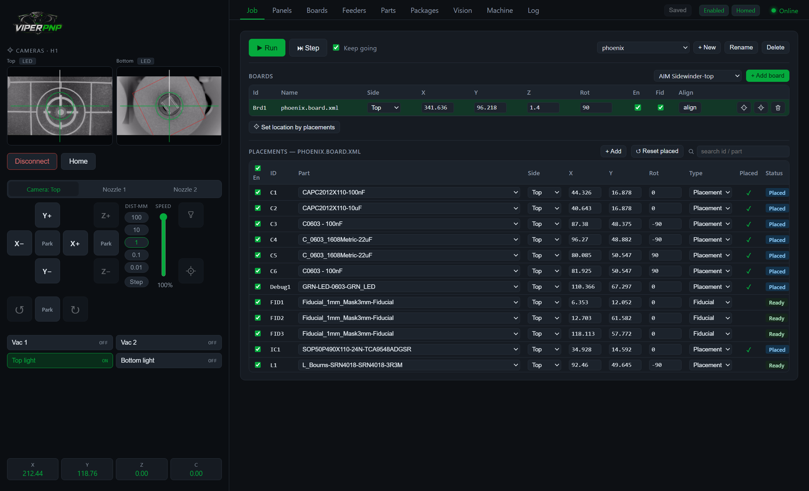
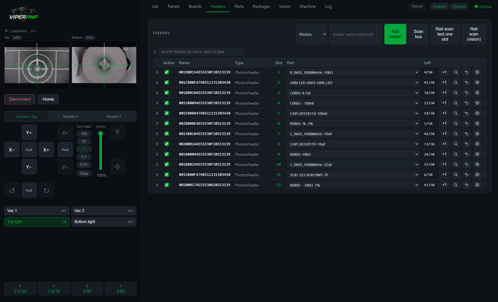
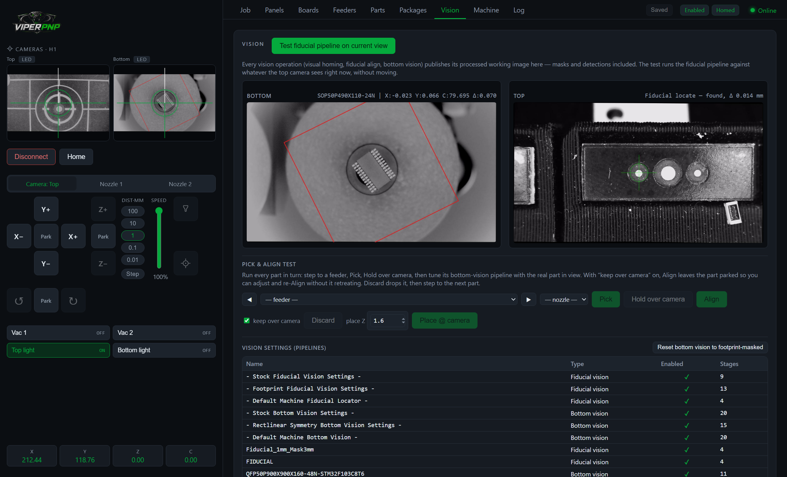

<p align="center">
  
</p>

<h3 align="center">The OpenPnP machine core with a modern, production-focused interface</h3>

<p align="center">
  <a href="https://github.com/invictuscockpits/viperpnp/releases">Download</a> ·
  <a href="https://github.com/invictuscockpits/viperpnp/wiki/Installation">Installation</a> ·
  <a href="https://github.com/invictuscockpits/viperpnp/wiki/Migrating-from-OpenPnP">Migrating from OpenPnP</a> ·
  <a href="https://github.com/invictuscockpits/viperpnp/wiki">Wiki</a>
</p>



ViperPNP is a fork of [OpenPnP](https://openpnp.org) built for day-to-day production work. The machine logic is OpenPnP's: the same drivers, motion planning, vision engine, feeder classes, and configuration format. On top of that core sits a single-window desktop app that puts jogging, cameras, feeders, jobs, and vision in one place, plus a set of machine-side improvements earned by running real production boards.

It was developed on and for the Opulo LumenPnP, but anything OpenPnP can drive, ViperPNP can drive. Your existing OpenPnP configuration [carries over directly](https://github.com/invictuscockpits/viperpnp/wiki/Migrating-from-OpenPnP), and knowledge from the OpenPnP community still applies.

## Highlights

**One window, always oriented.** A persistent sidebar keeps both cameras live with a tool-tracking reticle, jog controls, vacuum and light toggles, and a DRO in view no matter which tab you are on. Keyboard jogging works like a CNC pendant, including a continuous mode where holding an arrow key streams smooth motion. See [The Interface](https://github.com/invictuscockpits/viperpnp/wiki/The-Interface).

**Jobs that survive reality.** Placed status persists per placement and is saved after every step, so an interrupted job resumes exactly where it stopped and never double-places. Failed placements can defer instead of halting the run, and the end-of-job report tells you the actual reason each one was skipped. See [Jobs and Boards](https://github.com/invictuscockpits/viperpnp/wiki/Jobs-and-Boards).



**First-class Photon feeder support.** A hardened bus scan that does not unmap feeders on a single missed reply, a vision rail scan that refines every slot location from the feeder nose-board fiducials, per-tape vision references that re-lock the pocket after a feeder swap, uniform pick depth, and firmware-configurable film peel time. See [Photon Feeders](https://github.com/invictuscockpits/viperpnp/wiki/Photon-Feeders).

**Vision you can see.** Every vision operation publishes its processed working image, masks and detections included, into the UI. A pick-and-align test bench lets you pick a part, hold it over the bottom camera, and tune its pipeline with the real part in view. One click resets bottom vision to the footprint-masked pipeline. See [Vision and Calibration](https://github.com/invictuscockpits/viperpnp/wiki/Vision-and-Calibration).



**Guided machine setup.** Connection, motion, nozzles and tips, cameras, tool changer, actuators, and general settings each live in a card with teach buttons that use the machine itself: touch off head offsets on a fiducial, teach the bottom camera position with a nozzle, calibrate vacuum thresholds from live sensor reads.

The full list of changes relative to stock OpenPnP is on the wiki: [Improvements over OpenPnP](https://github.com/invictuscockpits/viperpnp/wiki/Improvements-over-OpenPnP).

## Getting started

Download the Windows installer from the [releases page](https://github.com/invictuscockpits/viperpnp/releases) and run it. Everything needed is bundled, including the Java runtime; nothing else has to be installed. First launch creates a default configuration, and the [migration guide](https://github.com/invictuscockpits/viperpnp/wiki/Migrating-from-OpenPnP) covers bringing an existing OpenPnP setup across.

## Building from source

The backend is the OpenPnP core plus an embedded [Javalin](https://javalin.io) server (`org.openpnp.viper.ViperServer`) that exposes a REST and WebSocket API on port 8077. The UI is React inside a Tauri 2 shell that talks to that API.

You need JDK 17, Maven, Node.js, and (for the desktop shell) Rust with the Tauri prerequisites.

```bash
mvn compile
```

```bash
cd viper-ui && npm install && npm run tauri dev
```

`dev.ps1` at the repo root compiles the backend, starts it, and launches the UI in one step on Windows. `build-installer.ps1` produces the self-contained NSIS installer, including a jlink-trimmed JRE. The backend can also run standalone and serve the built UI itself with `-Dviper.web=<dist dir>`, which is how the packaged app works.

## Relationship to OpenPnP

ViperPNP would not exist without OpenPnP and the years of work behind it. The fork keeps the core intact and current practice is to stay compatible with OpenPnP's configuration format, so a setup can move between the two. Machine-side fixes that make sense upstream are candidates for pull requests to OpenPnP.

ViperPNP is licensed under the [GPL-3.0](LICENSE.txt), the same license as OpenPnP.
